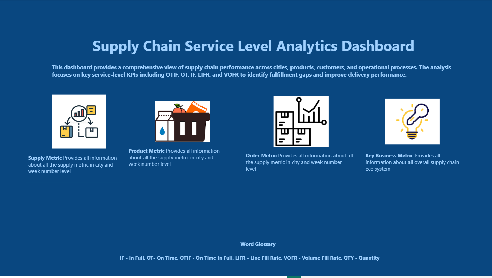
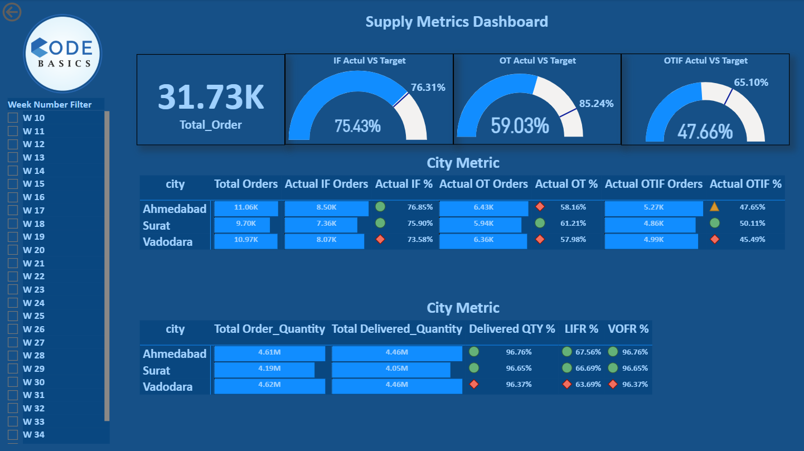
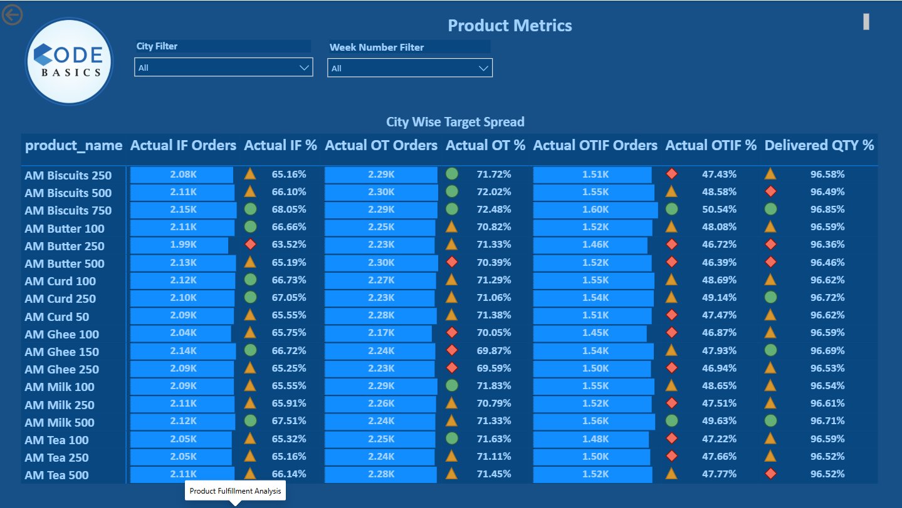
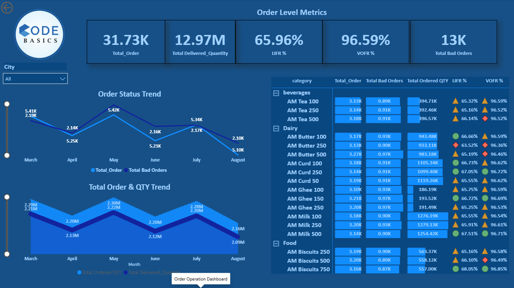
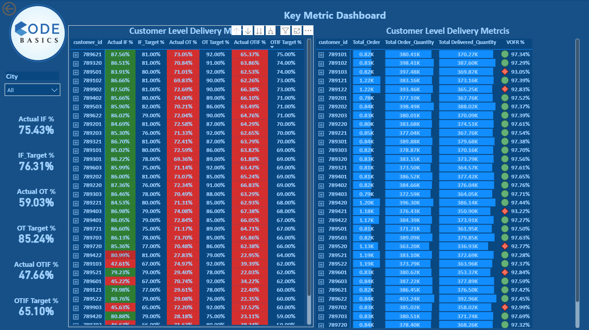

# Supply Chain Service Level Analytics Dashboard using Power BI

## Project Overview

Developed an end-to-end Power BI dashboard to monitor and analyze supply chain service-level performance across customers, products, and cities. The dashboard provides stakeholders with actionable insights into delivery performance and fulfillment efficiency through key operational KPIs.

---

## Business Problem

AtliQ Mart, a growing FMCG organization, aimed to improve customer satisfaction and operational efficiency by enhancing delivery performance. However, service levels were falling below business targets, impacting customer experience and operational effectiveness.

The business required a centralized analytics solution to:

- Monitor service-level KPIs across the supply chain.
- Identify fulfillment bottlenecks affecting OTIF performance.
- Compare actual performance against target benchmarks.
- Support data-driven operational decision-making.

---

## Project Objective

The objective of this project was to:

- Track supply chain service-level performance using critical KPIs.
- Identify operational gaps impacting delivery reliability.
- Analyze performance across customers, products, and cities.
- Provide actionable recommendations to improve fulfillment efficiency.

---

## Tools & Technologies Used

- Power BI
- Power Query
- DAX
- Data Modeling
- Interactive Dashboard Design
- Supply Chain KPI Analysis

---

## Key Performance Indicators (KPIs)

| KPI | Description |
|------|-------------|
| OTIF | On Time In Full – Orders delivered on time and completely fulfilled |
| OT | On Time Delivery Performance |
| IF | In Full Delivery Performance |
| LIFR | Line Fill Rate – Percentage of order lines fulfilled completely |
| VOFR | Volume Fill Rate – Percentage of ordered volume delivered |

---

## Dashboard Snapshots

### Executive Overview



---

### Service Level Performance



---

### Product Fulfillment Analysis



---

### Order Operations Dashboard



---

### Customer Service Analytics



---

## Business Questions Addressed

1. Are we meeting OTIF service-level targets?
2. Which cities are underperforming against delivery KPIs?
3. Which products contribute most to fulfillment failures?
4. How do actual service levels compare with business targets?
5. Which customers experience the highest delivery reliability?
6. How do service levels vary across products and locations?
7. What operational initiatives can improve OTIF performance?

---

## Key Insights

### Service-Level Performance

- OTIF performance remained significantly below business targets, indicating opportunities for process improvement.
- On-Time delivery emerged as the primary contributor to OTIF shortfalls.
- In-Full performance remained relatively stable compared to delivery timeliness.

### Operational Insights

- Certain cities consistently underperformed against service benchmarks.
- Product-level fulfillment performance varied considerably across categories.
- Customer-level service experience highlighted opportunities for targeted interventions.

### Supply Chain Insights

- Volume fulfillment rates remained strong, suggesting inventory availability was not the primary challenge.
- Operational execution and delivery efficiency represented the largest improvement opportunities.

---

## Business Recommendations

- Investigate root causes of delayed deliveries across low-performing regions.
- Optimize route planning and dispatch operations to improve On-Time performance.
- Implement customer-level service monitoring to proactively identify risks.
- Develop targeted improvement initiatives for underperforming products and cities.
- Establish continuous KPI monitoring to support operational decision-making.

---

## Business Impact

This dashboard enables stakeholders to:

- Monitor supply chain performance through a centralized reporting solution.
- Identify fulfillment bottlenecks affecting customer satisfaction.
- Track service-level KPIs against business targets.
- Support proactive operational improvements.
- Drive data-informed decisions to improve OTIF performance.

---

## Repository Structure

```text
powerbi-supply-chain-service-level-analytics/

├── README.md
├── business_questions.md
├── screenshots/
│   ├── executive_overview.png
│   ├── service_level_performance.png
│   ├── product_fulfillment_analysis.png
│   ├── order_operations_dashboard.png
│   └── customer_service_analytics.png
├── insights/
│   └── business_insights.md
└── assets/
    └── dataset_description.md
```

---

## Key Learnings

Through this project, I strengthened my ability to:

- Translate operational challenges into analytical solutions.
- Design executive-level Power BI dashboards.
- Analyze supply chain performance using business KPIs.
- Derive actionable insights from operational data.
- Communicate recommendations that support business outcomes.

---

## About the Dataset

- Domain: Supply Chain Analytics
- Industry: FMCG
- Focus Areas: OTIF Performance, Fulfillment Efficiency, Customer Service Levels, Operational Excellence

---

## Author

**Souvik Dutta**

Business Analyst | SQL | Power BI | Excel | Growth Strategy

Sales and analytics professional with 8+ years of experience across FMCG, E-commerce, and Quick Commerce, specializing in leveraging data to drive business growth, operational efficiency, and strategic decision-making.

- GitHub: https://github.com/Iamsouvikdutta
- LinkedIn: Add your LinkedIn profile URL here
